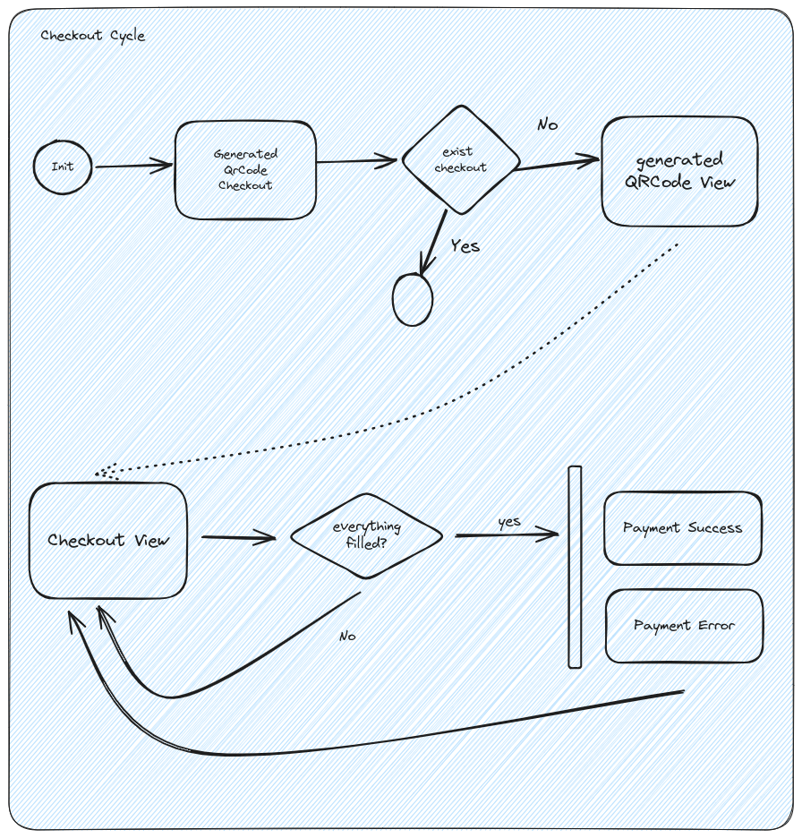

# payment-fiap-food

## Description

This project is a simple API to simulate a payment system for a food delivery application. It was developed as the tech challenger for the FIAP MBA in Software Architecture.

## Technologies

- Java 21
- Spring Boot 3.0.0
- Maven 3.8.1
- Docker 20.10.8
- Docker Compose 1.29.2
- MySQL 8.0.26

## Checkout Cycle Forms
