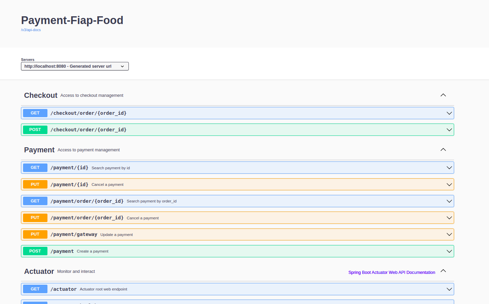

# payment-fiap-food

## Description

This project is a simple API to simulate a payment system for a food delivery application. It was developed as the tech challenger for the FIAP MBA in Software Architecture.

## Prerequisites:
- Apache Maven 3.+
- JDK 21
- Docker 20+
- Docker Compose 1.22.+

## Start application in Docker container in Docker:
```
    docker-compose up -d
```

## Stop all applications in Docker containers:
```
    docker-compose stop
```

## Start application in Docker container in Docker and rebuild service image:
```
    docker-compose up --build --force-recreate --no-deps -d 
```

## Swagger documentation:
```
    http://localhost:8080/swagger-ui.html
```

## Swagger


## Architecture


## Checkout Cycle Forms
